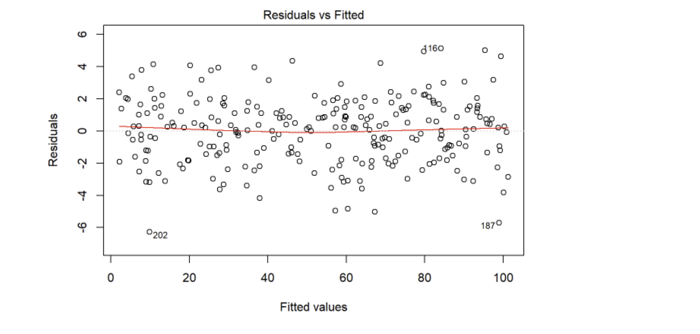

# Potential Questions for Interview Prep and Better Understanding 

### **Q1 What is Linear Regression?**
Linear Regression is a supervised machine learning algorithm where the predicted output is continuous and has a constant slope. It’s used to predict values within a continuous range, (e.g. sales, price) rather than trying to classify them into categories (e.g. cat, dog).


### **Q2 How does a Non-Linear regression analysis differ from Linear regression analysis?**
Non-linear functions have variables with powers greater than 1. Like $`x^2`$. If these non-linear functions are graphed, they do not produce a straight line (their direction changes constantly).

Linear functions have variables with only powers of 1. They form a straight line if it is graphed.

Non-linear regression analysis tries to model a non-linear relationship between the independent and dependent variables. Linear regression analysis tries to model a linear relationship between the independent and dependent variables.

### **Q3 How is the Error calculated in a Linear Regression model?**
1. Measuring the distance of the observed y-values from the predicted y-values at each value of x.
2. Squaring each of these distances.
3. Calculating the mean of each of the squared distances.

```math
\text{Mean Squared Error} = \frac{1}{n} \bigg(Y_i - \hatY_i \bigg)
```

4. The smaller the Mean Squared Error, the closer you are to finding the line of best fit
5. How bad or good is this final value always depends on the context of the problem, but the main goal is that its value is so minimal as possible.


### **Q4 How would you detect Overfitting in Linear Models?**

Overfitting is a modeling error that occurs when a function or model is too closely fit the training set and getting a drastic difference of fitting in test set. We can use the method of $`R^2`$ to determine the goodness of fit (how well the model fits the data). $`R^2`$ can be calculated as 

```math
R^2 = \frac{ \sum (\hat{y_i} - \bar{y})^2  }{ \sum (y_i - \bar{y})^2  }\\\\
\text{or }\\
R^2 = \text{cor}^2(\hat{y},y)
```
Its range is between $`0 \leq R^2 \leq 1`$. Values closer to 1 indicating better fits. It is a mistake to reply on $`R^2`$ as a sole measure of fit because this definition can produce incorrect results based on the data.

The summary() function in R uses the above definition to predict the $`R^2`$.

There is where the Adjusted $`R^2`$ comes into play. It takes into account the property of $`R^2`$ to inflate due to overfitting and adjusts accordingly. It introduces a penalty on $`R^2`$ for pushing insignificant variables into model, so while $`R^2`$ continues to rise even with insignificant variables, adjusted $`R^2`$ declines. One point to note here that divergence between $`R^2`$ and adjusted $`R^2`$ can be anaylzed for symtoms of overfitting. 

$`R^2`$ shows how well terms (data points) fit a curve or line. Adjusted $`R^2`$ also indicates how well terms fit a curve or line, but adjusts for the number of terms in a model. If you add more and more useless variables to a model, adjusted r-squared will decrease. If you add more useful variables, adjusted r-squared will increase.
Adjusted $`R^2`$ will always be less than or equal to R2.


Adjusted $`R^2`$ is calculated as:

```math
R_{\text{adj}}^2 = 1 - \bigg[ \frac{  (1-R^2) (n-1)  }{ n-k-1   } \bigg]
```
N is the number of points in your data sample.

K is the number of independent regressors, i.e. the number of variables in your model, excluding the constant.

Difference between Adjusted $`R^2`$ and $`R^2`$. 
$`R^2`$  assumes that every single variable explains the variation in the dependent variable. The adjusted $`R^2`$  tells you the percentage of variation explained by only the independent variables that actually affect the dependent variable.

### **Q5 What are types of Linear Regression?**
Simple linear regression uses traditional slope-intercept form. $`x`$ represents our input data and $`y`$ represents our prediction.

A more complex, multi-variable linear equation might look like this, where 𝑤 represents the coefficients, or weights, our model will try to learn.

## **Q6 What is the difference between Mean Absolute Error (MAE) vs Mean Squared Error (MSE)?**
The Mean Squared Error measures the variance of the residuals and is used when we want to punish the outliers in the dataset.

The Mean Absolute Error measures the average of the residuals in the dataset. Is used when we don’t want outliers to play a big role. It can also be useful if we know that our distribution is multimodal, and it’s desirable to have predictions at one of the modes, rather than at the mean of them. It's defined as:
```math
\text{MAE} = \frac{1}{N} \sum_{i=1}^{N} |y_i - \hat{y}|
```

### **Q7 Explain how does the Gradient descent work in Linear Regression**

The Gradient Descent works by starting with random values for each coefficient in the linear regression model.

* After this, the sum of the squared errors is calculated for each pair of input and output values (loss function), using a learning rate as a scale factor.
* For each iteration, the coefficients are updated in the direction towards minimizing the error,
* then we keep repeating the iteration process until a minimum sum squared error is achieved or no further improvement is possible.

### **Q8 Explain what the Intercept Term means**

The constant term in regression analysis is the value at which the regression line crosses the y-axis. The constant is also known as the y-intercept. The intercept term signifies the independent variable’s shift from the origin and ensures that the model would be unbiased. If we omit the intercept term, then the model is forced to go through the origin and the slope would become steeper and biased. Hence, we should not remove the intercept term unless we are completely sure that it is 0 according to theory and expectations.

### **Q10 How is Hypothesis Testing using in Linear Regression?**
Hypothesis testing is used in a linear regression model to test if the $`\beta_1`$ parameter in the linear equation is statistically significant. In other words, to check if the linear relationship that we obtained was not caused just by random chance.

The way to use hypothesis testing is described as follows:

* We start establishing the null hypothesis ($`H_0`$) that $`\beta_1`$  is not significant, i.e. there is no linear relationship between independent variables and the dependent variable. The alternative hypothesis (H1) is then that $`\beta_1`$  is not zero.
```math
H0\ :\ \beta_1 = 0\\
HA\ :\ \beta_1 \neq 0
```
* We compute the test statistic which could it be the T-test or the Z-test depending on how many samples the dataset has.
* We compute the corresponding p-value.
* If the p-value turns out to be less than 0.05, we can reject the null hypothesis and state that β1 is indeed significant at the 95% confidence level.

With this, we can validate that our model coefficients are not obtained just by random chance.

### **Q11 Name a disadvantage of R-squared and explain how would you address it?**

R-squared ($`R^2`$) is a statistical measure of how close the data are to the fitted regression line. It is also known as the coefficient of determination, or the coefficient of multiple determination for multiple regression.

R-squared takes values between 0 and 1, with 0 indicating that the proposed model does not improve prediction over the mean model and 1 indicating the perfect prediction. However, one drawback of R-squared is that its values can increase if we add predictors to the regression model, leading to a possible overfitting.

To address this issue, we can use Adjusted R-squared: a modified version of R-squared that has been adjusted for the number of predictors in the model. The adjusted R-squared increases when the new term improves the model more than would be expected by chance, and it decreases when a predictor improves the model by less than expected.

### **Q12  Name some Evaluation Metrics for Regression Model and when you would use one?**

* **Mean absolute error (MAE)**: calculates the absolute difference between actual and predicted values. It can be used when we want that our model be robust to outliers, but this metric has the disadvantage of not being differentiable so we can't use it if we want to apply optimizers like Gradient descent.

* **Mean squared error (MSE)**: calculates the squared difference between actual and predicted value. We can use this metric if we want to give bigger penalization to outliers and apply optimizers who require differentiation. MSE is a differentiable function that makes it easy to perform mathematical operations in comparison to a non-differentiable function like MAE.

* **Root mean squared error (RMSE)**: This is simply the square root of mean squared error. This metric is not so robust to outliers as the mean absolute error but it has the advantage to be differentiable so we can use it if we want to apply gradient descent to minimize losses.

When to use one depends on your loss function:

* **When to use MAE**: If being off by ten is just twice as bad as being off by 5. it is better to use the MAE if you don't want your performance metric to be overly sensitive to outliers.

* **When to use RMSE**: In many circumstances, it makes sense to give more weight to points further away from the mean - that is, being off by 10 is more than twice as bad as being off by 5. In such cases, RMSE is a more appropriate measure of error.

### **Q13 What are the Assumptions of Linear Regression?**

We make a few assumptions when we use linear regression to model the relationship between a response and a predictor. These assumptions are essential conditions that should be met before we draw inferences regarding the model estimates or before we use a model to make a prediction.

There are four principal assumptions which justify the use of linear regression models for purposes of inference or prediction:

1. Linearity: The model is correctly specified: $`E(Y)`$ is linear in the predictors. In other words, the relationship between X and the mean of Y is linear.
2. Independence: The observations are independent, i.e. data are recoreded from a random sample.In other words, observations are independent of each other.
3. Homoscedasicity: The response has the same constant variance. The variable of interset is evenly spread out about the mean for all observations. In other words, the variance of residual is the same for any value of X.
4. Normality: For any fixed value of X, Y is normally distributed.

### **Q14 Why would you use Normalisation vs Standardisation for Linear Regression?**
* Normalization transforms your data into a range between 0 and 1
* Standardization transforms your data such that the resulting distribution has a mean of 0 and a standard deviation of 1

Normalization/standardization are designed to achieve a similar goal, which is to create features that have similar ranges to each other. We want that so we can be sure we are capturing the true information in a feature and that we don't overweigh a particular feature just because its values are much larger than other features.

If all of your features are within a similar range of each other then there's no real need to standardize/normalize. If, however, some features naturally take on values that are much larger/smaller than others then normalization/standardization is called to fix it.

If you're going to be normalizing at least one variable/feature, I would do the same thing to all of the others as well.

### **Q15 Explain the Stepwise Regression technique**
Stepwise Regression is a feature selection technique which objective is to reduce the number of features and, hence, reduce the computational complexity of the model. This technique is based on select models with the lowest p-values.

For illustrated this technique let's suppose we got 6 predictors in the dataset, so in order to perform stepwise regression we must follow the next steps:

1. We fit the model with one predictor and the target variable. We tried each predictor one by one for then compute its p-value. Let's say that among all predictors the model with the lowest p-value was the one that contains only X1, so we keep this model.

2. Now will fit the model with two predictors. One we have already selected in step 1 and for the second predictor, we will try one by one with all remaining predictors. In other words, we fit one model using X1 and X2, another model using X1 and X3, and so on. For each case we compute the p-value and once again we select the model with the lowest p-value.

3. Now will try to fit the model with three predictors. We take the predictors already selected in step 2 and the third could it be any of the remaining ones. But if in this process we found that for each possible model we no longer reach a p-value less than 0.05 we stop this process. A p-value greater than 0.05 means that the model is not significant so we can reject it.

By following the previous steps we can get the smallest set of features that have a significant impact on the final model fit, and at the same time, reduce computational cost and avoid overfitting.

### **Q16 How would you check if a Linear Model follows all Regression assumptions?**

For check *Linearity*: we plot the residual values vs fitted values. If there exists any pattern (maybe, a parabolic shape) in this plot, we can consider it as signs of non-linearity in the data. What we want to see:



To check *Normality*: we can use a Q-Q plot, if the data comes from a normal distribution the plot would show a fairly straight line. Otherwise, we would see a deviation in the straight line.

*So far, I have studied these two. I will have to search and learn about checking the other condidtions.* 


### **There are more questions related to linear regression but they fall under Multiple Linear Regression, so we will discuss them in Section 2.2.**


Material is taken from the following sources:

https://www.statisticshowto.com/probability-and-statistics/statistics-definitions/adjusted-r2/

https://www.mlstack.cafe/blog/linear-regression-interview-questions