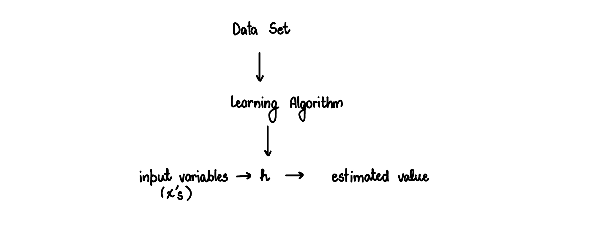
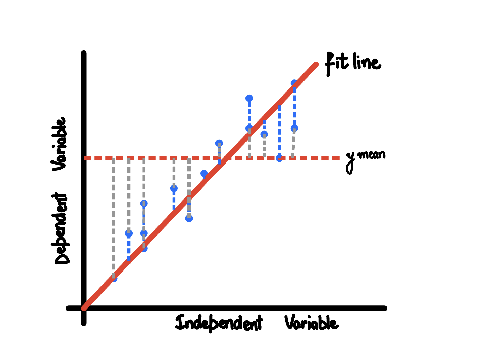

# Linear Regression

The main idea behind Linear Regression (or fitting a line to a data) is that we want to minimize the squares of the distance between the observed values and the line. 

Let's suppose that we have a data set, we feed that data set to the Learning Algorithm which predicts the output values for new data points. The below figure illsurates it clearly.



$`h: x \to y`$. $`h`$ maps x's to y's, the input variables to the estimated values of y. Here, h is the hypothesis function. For linear regression, we represent the hypothesis function as 

```math
h_{\theta}(x) = \theta_0 + \theta_1 x
```
which is an equation for a straight line.

## Cost Function

Cost function lets us figure out how to fit the best possible line to our data. In the hypothesis, $`\theta_{i's}`$ are called the *parameters*. What is the best way to choose these parameters? 

The idea is to choose the parameters so that the hypothesis, $`h_{\theta}(x)`$ (the values we predict using the linear regression) is close to $`y`$ for our training examples (data set/ data points).

Thus, we would be solving the minimization problem:
```math
\underset{\theta_1, \theta_2}{\text{minimize}}\ \sum_{i=1}^{m} \frac{1}{2m} \bigg( \underbrace{h_{\theta}(x^{(i)})}_{\text{prediction for a variable}} - \underbrace{y^{(i)}}_{\text{actual value for the same variable}} \bigg)^2
```

This becomes are Cost Function and we will denote it by $`J(\theta_0, \theta_1)`$

This Cost Function is also called **Squared Error Function**.





## Gradient Descent

Gradient Descent is an algorithm which can be used to minimize the cost function for linear regression model. Gradient Descent can not only be applied to linear regression but to a wide variety of other models too.

* Have some function $`J(\theta_0, \theta_1)`$
* Want $`\underset{\theta_0, \theta_1}{\text{min }} J(\theta_0, \theta_1)`$

**Outline:**
* Start with some $`\theta_0, \theta_1`$ (say $`\theta_0=0,\ \theta_1=0`$)
* Keep changing $`\theta_0,\ \theta_1`$ to reducee $`J(\theta_0, \theta_1)`$ until we hopefully end up at a minimum.

I studied Gradient Descent in Numerical Analysis series! 

```math
\text{repeat until convergence} \{\\
    \theta_j := \theta_j - \alpha \frac{\partial}{\partial \theta_j}J(\theta_0, \theta_1) \qquad (\text{for j = 0 and j = 1})
  \\  \}
```

*Correct: Simultaneous Update*

```math
\text{temp0} := \theta_0 - \alpha \frac{\partial}{\partial \theta_0} J(\theta_0, \theta_1)\\
\text{temp1} := \theta_1 - \alpha \frac{\partial}{\partial \theta_1} J(\theta_0, \theta_1)\\
\theta_0 := \text{temp0}\\
\theta_1 := \text{temp1}
```

**Gradient Descent for Linear Regression**
We are going to apply the gradient descent algorithm to the cost function to minimize the cost function.

```math
\begin{align}
\frac{\partial}{\partial \theta_j}J(\theta_0, \theta_1) & = \frac{\partial}{\partial \theta_j} \frac{1}{2m} \sum_{i=1}^{m} \bigg( h_{\theta}(x^{(i)}) - y^{(i)} \bigg)^2 \\
& = \frac{\partial}{\partial \theta_j} \frac{1}{2m} \sum_{i=1}^{m} \bigg( \theta_0 + \theta_1 x^{(i)} - y^{(i)} \bigg)^2 
\end{align}
```

```math
\theta_0 := \frac{\partial}{\partial \theta_0} J(\theta_0, \theta_1) = \frac{1}{m} \sum_{i=1}^{m} \bigg(h_{\theta}(x^{(i)}) - y^{(i)} \bigg) \\
\theta_1 := \frac{\partial}{\partial \theta_1} J(\theta_0, \theta_1) = \frac{1}{m} \sum_{i=1}^{m} \bigg(h_{\theta}(x^{(i)}) - y^{(i)}\bigg) \cdot x^{(i)}
```

Thus, the algorithm turns out to be 
```math
\text{Repeat until convergence } \{ \\
\begin{align}
\theta_0 &:= \frac{\partial}{\partial \theta_0} J(\theta_0, \theta_1) = \frac{1}{m} \sum_{i=1}^{m} \bigg(h_{\theta}(x^{(i)}) - y^{(i)} \bigg) \\
\theta_1 &:= \frac{\partial}{\partial \theta_1} J(\theta_0, \theta_1) = \frac{1}{m} \sum_{i=1}^{m} \bigg(h_{\theta}(x^{(i)}) - y^{(i)}\bigg) \cdot x^{(i)}
\end{align}\\
\}
```

We do not need to explicitly write an algorithm for gradient descent, because the python and R libraries already include such algorithm to provide us a linear regression with least squared error.