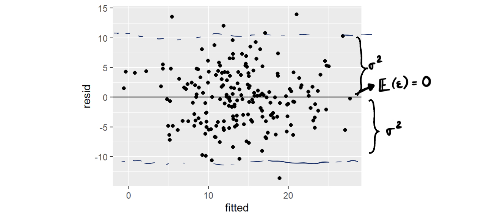
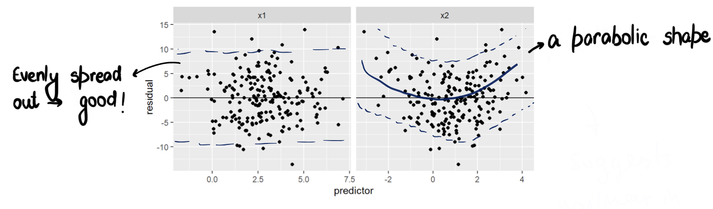
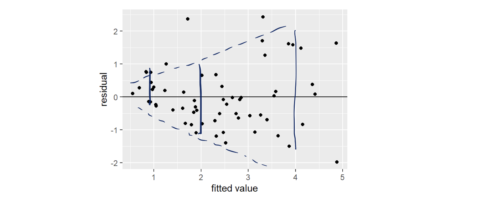
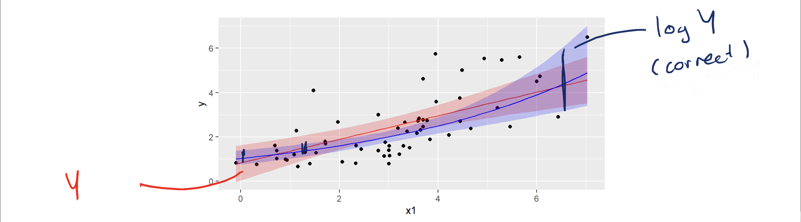

# Potential Concepts and Questions for Interviews and Better Understanding 

### Q1  What are the basic assumptions of the Linear Regression Algorithm?

* **Assumptions about the form of the model**: It is assumed that there exists a linear relationship between the dependent and the independent variables. This assumption is known as the ‘**linearity assumption**’.

* **Assumptions about the residuals**: 
1. Normality assumption: The error terms, ε(i), are normally distributed.
2. Zero mean assumption: The residuals have a mean value of zero.
3. Constant variance assumption: The residual terms have the same (but unknown) value of variance, $`\sigma^2`$. This assumption is also called the assumption of homogeneity or **homoscedasticity**.
4. Independent error assumption: The residual terms are independent of each other, i.e. their pair-wise covariance value is zero.

* Assumptions about the estimators: 
1. The independent variables are measured without error.
2. There does not exist a linear dependency between the independent variables, i.e. there is no multicollinearity in the data.


### Q2 Explain the Gradient Descent algorithm with respect to linear regression.

Gradient descent is a first-order optimization algorithm. In linear regression, this algorithm is used to optimize the cost function to find the values of the $`\beta_{i's}`$ (estimators) corresponding to the optimized value of the cost function.

The working of Gradient descent is similar to a ball that rolls down a graph (ignoring the inertia). In that case, the ball moves along the direction of the maximum gradient and comes to rest at the flat surface i.e, corresponds to minima.

This can also be understood by taking the following idea into consideration: Suppose we are standing on a rough hilly terrain, which becomes the first random point in the Gradient Algorithm. After looking all around ourself, we examine the direction to move which would get us to a lower latitute. This is one step of the algorithm. After this, we update the variables and run the algorithm again to move one step. We keep doing this until we reach the minimum point.

### Q4 List down some of the metrics used to evaluate a Regression Model.

* Mean Absolute Error(MAE)
* Mean Squared Error(MSE)
* Root Mean Squared Error(RMSE)
* R-Squared(Coefficient of Determination)
* Adjusted R-Squared

### Q5 For a linear regression model, how do we interpret a Q-Q plot?

The Q-Q plot represents a graphical plotting of the quantiles of two distributions with respect to each other. In simple words, we plot quantiles against quantiles in the Q-Q plot which is used to check the normality of errors.

Whenever we interpret a Q-Q plot, we should concentrate on the ‘y = x’ line, which corresponds to a normal distribution. It implies that each of the distributions has the same quantiles. In case you witness a deviation from this line, one of the distributions could be skewed when compared to the other i.e, normal distribution.

### Q6 In linear regression, what is the value of the sum of the residuals for a given dataset? Explain

The sum of the residuals (or Errors) in a linear regression model is 0 since it assumes that the errors (residuals) are normally distributed with an expected value or mean equal to 0, i.e. $`\epsilon \sim N(0, \sigma^2)`$ for the $`Y = \beta^T X + \epsilon`$ model.

Here, $`Y`$ is the dependent variable or the target column, $`\beta`$ is the vector of the estimates of the regression coefficient, $`X`$ is the feature matrix containing all the features as the columns, and $`\epsilon`$ is the residuals.

$`N(\mu, \sigma^2)`$ denotes the standard notation for a normal distribution having mean $`\mu`$ and standard deviation $`\sigma^2`$.

### Q7 Why do we square the residuals instead of using modulus?

* The squared function is differentiable everywhere, while the absolute error is not differentiable at all the points in its domain(its derivative is undefined at 0). This makes the squared error more preferable to the techniques of mathematical optimization.

### Q8 List down the techniques that are adopted to find the parameters of the linear regression line which best fits the model.

There are mainly two methods used for linear regression:

1. Ordinary Least Squares(Statistics domain): To implement this in Scikit-learn we have to use the LinearRegression() class.
2. Gradient Descent(Calculus family): To implement this in Scikit-learn we have to use the SGDRegressor() class.

### Q9 Which evaluation metric should you prefer to use for a dataset having a lot of outliers in it?

*Mean Absolute Error(MAE)* is preferred when we have too many outliers present in the dataset because MAE is robust to outliers whereas MSE and RMSE are very susceptible to outliers and these start penalizing the outliers by squaring the error terms, commonly known as residuals.

### Q10 Explain the normal form equation of the linear regression.

The normal equation for linear regression is :
```math
\beta = (X^T X)^{-1} X^T Y
```

### Q11 What are R-squared and Adjusted R-squared?

R-squared, also known as the coefficient of determination measures the proportion of the variation in your dependent variable (Y) explained by your independent variables (X) for a linear regression model. The main problem with the R-squared is that it will always remain the same or increases as we are adding more independent variables. Therefore, to overcome this problem, an Adjusted-$`R^2`$ comes into the picture by penalizing those adding independent variables that do not improve your existing model.

### Q12 What are the flaws in R-squared?

* Problem 1: As we are adding more and more predictors, $`R^2`$ always increases irrespective of the impact of the predictor on the model. As $`R^2`$ always increases and never decreases, it can always appear to be a better fit with the more independent variables(predictors) we add to the model. This can be completely misleading.

* Problem 2: Similarly, if our model has too many independent variables and too many high-order polynomials, we can also face the problem of over-fitting the data. Whenever the data is over-fitted, it can lead to a misleadingly high $`R^2`$ value which eventually can lead to misleading predictions.

### Q13  How is Hypothesis testing used in Linear Regression Algorithm?

1. *To check whether an independent variable (predictor) is significant or not for the prediction of the target variable. *

Two common methods for this are —
By the use of p-values: If the p-value of a particular independent variable is greater than a certain threshold (usually 0.05), then that independent variable is insignificant for the prediction of the target variable.

By checking the values of the regression coefficient: If the value of the regression coefficient corresponding to a particular independent variable is zero, then that variable is insignificant for the predictions of the dependent variable and has no linear relationship with it.

2. *To verify whether the calculated regression coefficients i.e, with the help of linear regression algorithm, are good estimators or not of the actual coefficients.*

### Q14 What are some ways to check if the linear model assumptions hold?

The following plots are the most frequently inspected diagnostics:
1. Residuals versus fitted values
* Can detect nonlinearity, nonconstant variance, and (sometimes) positive correlation
* Good starting point


2. Residuals versus predictors
* Cant detect nonlinearity
* Helpful for determing a fix
We can plot the residuals against each predictor, which is more helpful in kind of pinpointing a non-linear issue.


3. Quantile-Quantile plot of residuals
* Can detect non-normality


### Q15 What is a fix for the above Diagnostic 2

A fix would be to correct the way the data is entering the model. To be specific in this case, we can modify the linear regression equation by adding an extra parameter along with a polynomial power of the $`x`$.

### Q16 Talk about Constant variance diagnostic check, its fix, and its consequence 

When we plot the fitted_values versus residuals plot, if we get something like below:


* It has a fan shape: the residuals get more spread out as the eye moves from left to right.
* So higher variance for larger mean values of the response.

The easiest fix is to consider a transformation of the response variable, Y (log, square root or other power transformation). After the transformation, the plot of fitted versus residuals should be as we expect it to be (no pattern).

The main consequence of missing the assumption faulire is that the intervals won't achieve the correct coverage. For example, 



* Red is the model without the transformation; blue is the model with the transformation
* After transformation: narrower intervals at left; wider at right.

* If we do not care too much about intervals or uncertaninity, then the non-constant variance might not be that too much of a problem for us.

* If we are only doing predictions, these might be about equally predictably accurate - can compute MSE to check this out.

* Practitioners often have mixed feelings about transformations: one can find the model with more plausible assumptions but it could get harder to interpret it.

* Better avoided unless absolutely neccessary: estimates are still unbaised if the model is well-specified; so it depends on the objective.


### Comment on Normality Diagonstics

It can be detected with the help of Q-Q plots. If the data points are scattered at the edges, then it means that the model has a non-normality. The more the points fall on the normality line, the better. There is nothing we can do about it, so we proceed further nonetheless.

### Comment on Independence Diagonstics

There is no standard diagonstic for checking independence. Usually this should follow from a good sampling design.
