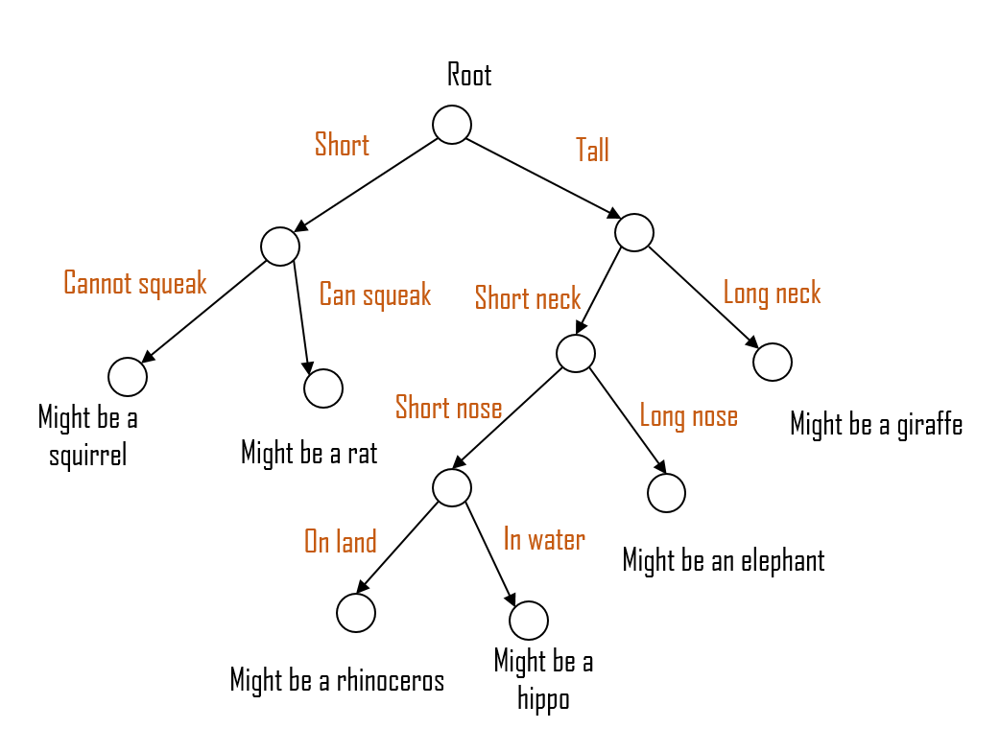

# Regression Trees 

Regression Trees are a type of Decision Trees. In a regression tree, each leaf represents a numeric value. In contrast Classification Trees have True or False in their leaves or some other discrete category.

Tree-based learning algorithms are a broad and popular family of related non-parametric, supervised methods for both classification and regression. The basis of tree-based learners is the decision tree wherein a series of decision rules (such as "if their gender is male, ..." or "if today is monday, ...") are chained. The result looks vaguely like an upside-down tree, with the first decision rule at the top and subsequent decision rules spreading out below. In a decision tree, every decision rule occurs at a decision node, with the rule creating branches leading to new nodes. A branch without a decision rule at the end is called a leaf.

Lecture Notes from Cornell Univeristy on Decision Trees:

https://www.cs.cornell.edu/courses/cs4780/2018fa/lectures/lecturenote17.html

My handwritten Notes are in the Machine Learning: Ball Trees and Decision Trees pdf file. 

Since the Classification Trees come before the Regression trees, I will cover the question answer on regression trees after I gather stuff for classfication trees.