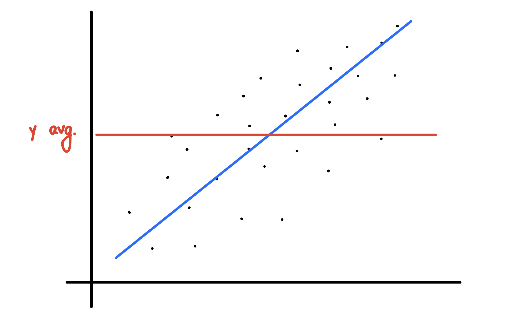

# R Squared and Adjusted R Squared Intuition



The blue line is the regression line, and red line is the average of the y points. 

Now for the blue line,

```math
SS_{res} = \sum (y_i - \hat{y}_{i})^2
```
is the sum of residuals of the points. And 

```math
SS_{total} = \sum (y_i - \hat{y}_{avg})^2
```
is the sum of residuals of the red line.

Then, R Squared becomes

```math
R^2 = 1 - \frac{SS_{res}}{SS_{total}}
```

The intention behind to do this that we are trying to fiddle a line to minimize the sum of squares of residuals. R Squared tells us how good is our line (blue one) compared to the average of line (red one). 
 
The ideal scenario is when $`SS_{res} = 0`$, and $`R^2 = 1 = R`$, but this never happens. Furthermore, the closer $`R^2`$ is to 1, the better. 
 
Can $`R^2`$ be negative? YES. It can be negative, for example if $`SS_{res}`$ fits the data worse than the average line.

$`R^2`$ is normally between 0 and 1.

# Adjusted $R^2$

We talked about $`R^2`$ for a simple linear regression while the same concept apply for a mutiple linear regression. For example, 
```math
y = b_0 + b_1 x_1
y = b_0 + b_1 x_1 + b_2 x_2
```

$`R^2`$ will be calculated in the same way as before. $`SS_{res}`$ is calculated and the minimum valued $`SS_{res}`$ is choosen. 

So, we want to use $`R^2`$ as a goodness of fit. The greater the number, the better it is. But what if we starts to add more and more variables to our model? 

Let's say we have added another variable to the model, $`b_3 x_3`$, $`SS_{res}`$ will not decrease, it can either remain the same, or increase, furthermore decreasing $`R^2`$. One more thing to notice here is that the new variable $`b_3`$ will never be zero, thus $`SS_{res}`$ will never be remain the same, and increase. The will always be a slight random correlation between the independent variable and dependent variable. 

$`R^2`$ is baised. It will always increase regardless of the actual improvement or not in the fit. So, we need to come up with a different measure of the fit. Hence, we get Adjusted $`R^2`$.

Formula for adjusted $`R^2`$
```math
adj R^2 = 1 - (1-R^2)\frac{n-1}{n-p-1}
```
where p is the number of regressors (# of independent variables) and n is the sample size .

Adjusted $`R^2`$ has a penalization factor. It penalizes you for adding independent variables that do not help your model.

In the formula, p is in the denominator. If p increases, the fraction increases $`\Rightarrow`$ the whole formula decreases. 

When normal $`R^2`$ increases, $`(1-R^2)`$ decreases $`\Rightarrow (1-R^2)\frac{n-1}{n-p-1}`$ decreases.

So, by adding a variable, we are increasing $`R^2`$, and increasing p. Both of these quantites battle to give us a appropriate adjusted $`R^2`$. 

If our new variable is not helping the model, then $`R^2`$ will be an unsignificant increase, and $`\frac{n-1}{n-p-1}`$ will drive adjusted $`R^2`$ down.

If our new variable is helping the model a lot, then $`R^2`$ will be an significant increase such that it will overwhelm the penalization factor, $`\frac{n-1}{n-p-1}`$ such that adjusted $`R^2`$ will go up.

