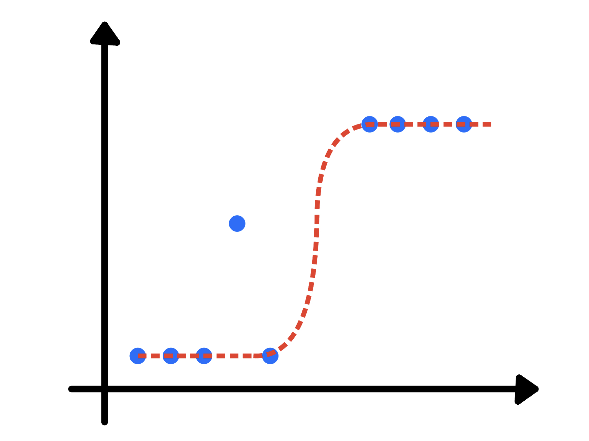

# Logistic Regression

Logistic Regression is similar to linear regression except it predicts whether something is true or false instead of predicting something continuous. Also, instead of fitting a line to a data, logistics regression fits an "S" shaped logistic function. The curve goes from 0 to 1. This means that the curve reveals if the probability of something is true or not. 



Linear Regression is based on the concept: we find the line that minimize the sum of the squares of the residuals (how far a data is from the linear line). We used the residuals to calculate $`R^2`$ and to compare simple models to complicated models. Logistic regression is not based on the same concept of "residuals", so it cannot use least squares and cannot calculate $`R^2`$.


Logistic Regression is usually used for classification. Logistic regression's ability to provide probability and classify new samples using continuous and discrete measurements makes it a popular machine learning method. It is computationally faster than some other models.

## Logistic Response Function and Logit

The first step in the Logistic Regression is to think of the outcome variable not as a binary label, but as the probability $`p`$ that the label is a "1". For a linear model, we have 
```math
p = \beta_0 + \beta_1 x_1 + \beta_2 x_2 + \ldots + \beta_n x_n
```


The linear model above does not ensure that $`0 \leq p \leq 1`$, so we use a transformation, logistic response or inverse logit function to the predictors: 
```math
p = \frac{1}{1 + e^{-(\beta_0 + \beta_1 x_1 + \beta_2 x_2 + \ldots + \beta_n x_n)}}
```
which makes ensure that $`0 \leq p \leq 1`$.


## Math Behind the Model

$`Odds`$ are the ratio of "success" (1) to "nonsuccess" (0). In terms of probability, odds are the probability of an event divided by the probability that the event will not occur.
```math
\text{Odds}(Y = 1) = \frac{p}{1-p}
```

Taking the inverse of the Odds function, 
```math
p = \frac{\text{Odds}}{ 1 + \text{Odds}}
```

We will consider the Odds function rather than the exponential function, i.e
```math
\text{Odds}(Y=1) = e^{\beta_0 + \beta_1 x_1 + \beta_2 x_2 + \ldots + \beta_n x_n}
```


Taking log on both sides, 
```math
\text{log(Odds}(Y=1)) = \beta_0 + \beta_1 x_1 + \beta_2 x_2 + \ldots + \beta_n x_n
```

We see that we have obtained a linear function of the predictors, called the $`logit`$ function which maps $`p: (0,1) \rightarrow (-\infty, \infty)`$.

Using this transformation, we have a linear model to predict a probability, which, in turn, we can map to a class label by applying a cutoff rule; any record with a probability greater than the cutoff is classified as a 1.

## Logistic Regression as GLM (Generalized Linear Model)

Logistic Regression is by far the most common form of GLM. Logistic Regression is a special instance of a GLM developed to extend linear regression to other settings. All the fancy things can be done using logistic regressions. All we have to remember is that the scale for the coefficients is log(odds).


## Maximum Likelihood

Here, we are going to talk about how the curve (S shaped) is optimized to fit the data the best. As we know that we transform the y-axis from the probability of the variable to log of odds (dependent variables). We can draw a candidate "best-fitting" line of the graph, but the transformation pushes the raw data to positive and negative infinity, which means that the residuals are also equal to postive and negative infinity. Thus, we cannot use least squares or $`R^2`$ to find the best fitting line. Instead we use Maximum Likelihood. 

 function representation")

First, we project the original data points onto the candidate line.

 function representation 2")

This gives each sample a candidate log(odds) value. For example the log(odds) of a blue point on the linear line is the y-axis corresponding value. After finding those log(odds), we transform the candidate logs(odds) to candidate probabilities using the following formula:
```math
p = \frac{e^{\text{log(odds)}}}{1+e^{\text{log(odds)}}}
```

which is just just a reordering of the transformation from probability to log(odds).
```math
\text{log}(\frac{p}{1-p}) = \text{log(odds)}
```


 function")

The inverse can be done by the inverse function 
```math
p = \frac{ e^{\text{log(odds)}} }{1 + e^{\text{log(odds)}} }
```

Here, the y-axis corresponding value of the data point is considered to be the probability value, and that is why it is the same as the likelihood. So we calculate the individual likelihood and add them
```math
\text{log(likehood of data given the curve)} = \text{log}(y_1) + \text{log}(y_2) + \ldots + \text{log}(y_n)
```

where n are number the data points and $`y_1,\ y_2, \ldots ,\ y_n`$ are the corresponding y-axis value to the data points.

For example, let the log-likelihood of the data given the curve is -3.77. This means that log-likelihood of the original line is -3.77. 

Now, we rotate the linear line, and calculate the log-likelehood of the new this line, transform the log(odds) to probabilities in calculating the log-likelihood.

Note: The algorithm that finds likelihood is pretty smart - each time it rotates the line, it does so in a way that increases the log-likelihood. Thus, the alorithm can find the optimal fit after a few rotations.


## R-Squared and p-value

It is hard to calculate R-Squared and p-value of a Logistic Regression, but there are multiple ways to do it. A good starting point is to see what other people are doing in your field. We will talk about McFadden's Pseudo $`R^2`$. This method is very close to how $`R^2`$ is calculated for regular linear models.

For a simple linear model,
```math
R^2 = \frac{\text{Sum squared regression (SSR)}}{\text{Total sum of squares(SST)}}
```
```math
R^2 = \frac{\sum (y_i - \hat y_i)^2}{\sum (y_i - \bar y)^2 }
```

Also, $`0 \leq R^2 \leq 1`$.

For Logistic Regression, we are going to use concept of maximum likelihood inplace of sum of squares (/residuals). Thus the forumula becomes:
```math
R_{\text{McFadden}}^2 = 1 - \frac{\text{Log} (L_c)}{\text{Log}(L_{\text{null}) }}
```
where $`L_c`$ denotes the (maximized) likelihood value from the current fitted model, and $`L_{\text{null}}`$ denotes the corresponding value but for the null model – the model with only an intercept and no covariates.