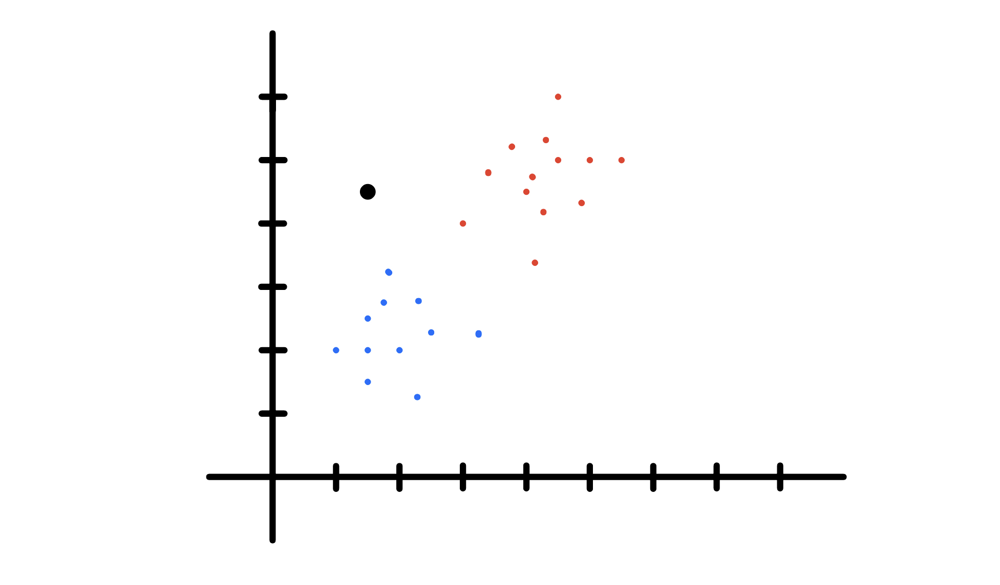

# K-Nearest Neighbors Algorithm

K-NN Algorithm is a super simple way to classify data.

Steps to start;

1. Start with a dataset with known categories. In this case, we have two types of data points, red and blue.

2. Add a new data point (black in our case) with unknown category. We do not know the category of this data point due to a reason.

3. We classify the new data point by looking at the nearest annoted cells (i.e. the "nearest neighbors"). If the "K" is "K-Nearest Neighbors" is equal to 1, then we only use the nearest neighbor to define the category. Similarly, if we set K = 10, we use 10 nearest data points to define the category. In our case, 6 nearest neighbors are red and 4 are blue. Thus the black data point gets the category of red data points.

If the data point is right in the middle of two categories, then

(a) If K is odd, then we can aviod a lot of ties.

(b) If we still get a tied vote, we can flip a coin or decide not to assign the category.

## A few thoughts on picking a value for "K"

- There is no physical or biological way to determine the best value for "K", so we may have to try out a few values before setling on one. Do this by pretending part of the training data is "unkown".

- Low values for K (like K = 1 or K = 2) can be noisy and subject to the effects of outliers.

- Large values of K smooth over things, but you do not want the K to be so large that a category with only a few samples in it will always be out voted by other categories.

