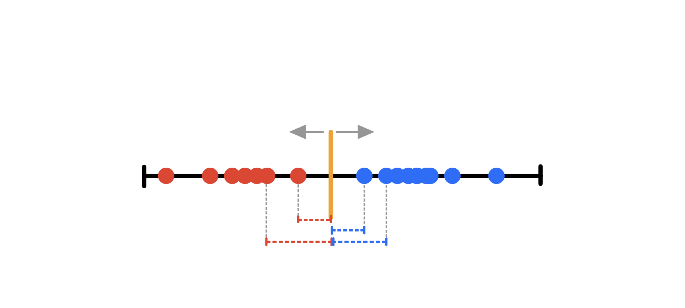
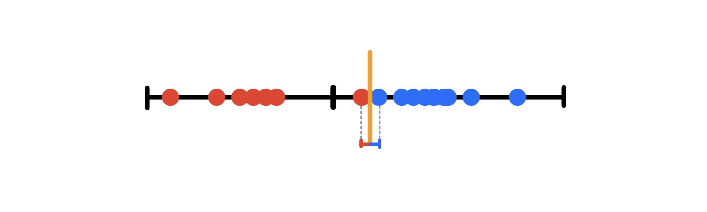
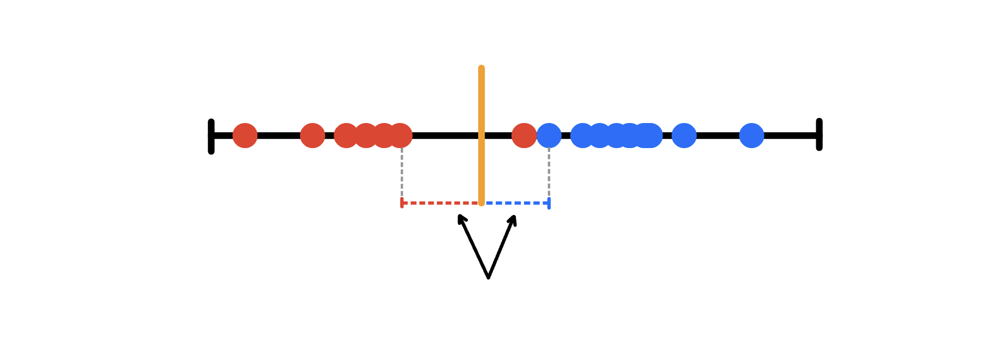
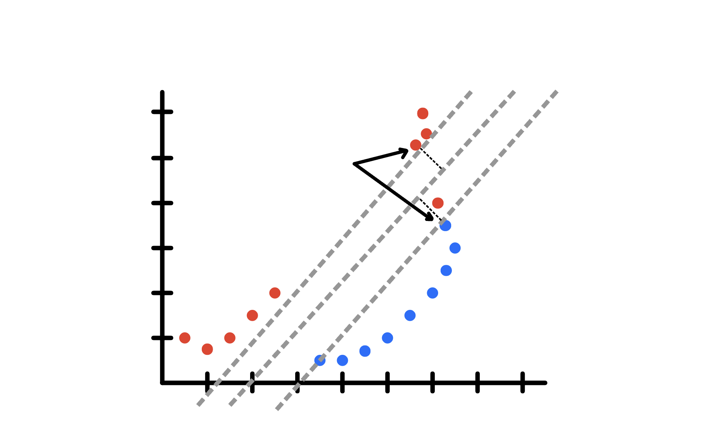
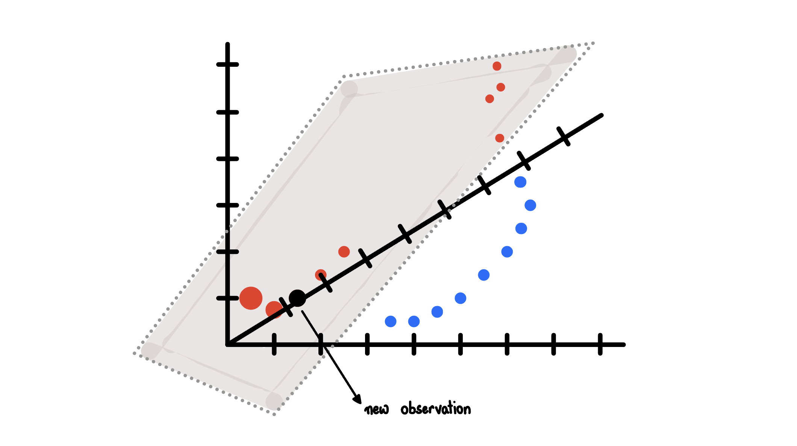
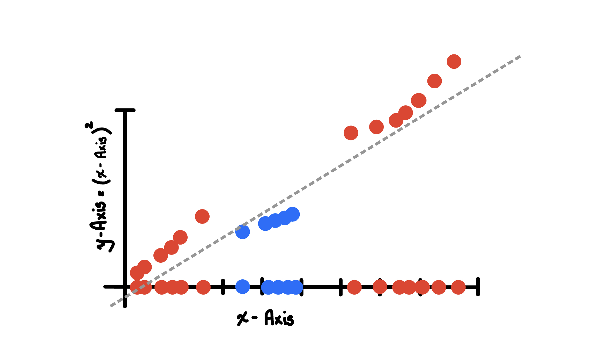

# Support Vector Machines (SVM)

Let us say that we have a dataset which can be classified as follows:



Looking at the graph we can classify a new data point on the basis where it lands. If it lands on the left side of the orange threshold bar, it will be assigned a red category, or otherwise blue. 

Now, let us say that we place the orange threshold bar right near to the right most red point. A new data point comes in and gets placed on the just right of the orange bar, then it should be classified as a blue category. Even though the method was correct, the outcome is not the most optimal one. This could lead to bad predictions.

**Margin**

The shortest distance between the observations and the threshold is called the Margin.

**Maximal Margin Classifier**

When we use the threshold that gives us the largest margin to make classifications, we are using a Maximal Margin Classifier.



If we have a outlier (like we talked about above), then the maximum margin classifier would be super close to the blue data points. If a new data point comes in at just left to the right most red point, it will be classified as red category. Thus, *Maximal Margin Classifiers* are super sensitive to outliers in the training data and that makes them a not very good model to work with sometimes.

To make a threshold that is not so sensitive to outliers, we must *allow misclassifications*. Choosing a threshold that allows misclassifications is an example of Bias/Variane Tradeoff that.

**Soft Margin**

We we allow misclassifications, then distance between the observations and the threshold is called a *Soft Margin*.



**How do we konw that the margin is a soft margin?**

How can we tell that the soft margin in the above figure is the better than any other soft margin? 

We use *Cross Validation* to determine  how many misclassifications and observations to allow inside of the Soft Margin to get the best classification.


**Support Vector Classifier**

When we use a Soft Margin to determine the location of a threshold, then we are using a *Support Vector Classifier* to classify observations. The name comes from the fact that observations (data points) on the edge and within the Soft Margin are called Support Vectors.


**2-D Support Vector Classifier is a line**



The Soft Margin is measured from the marked two points. The gray lines gives us a sense of where all of the other points are in relation to the soft Margin. Every other data point from the Soft Margin are outside the soft margins. The one red data point inside the Soft Margin is misclassified. Just like we before we used Cross Validation to determine that allowing this classification results in better classification in the long run.


**3-D Support Vector Classifier is a line**




We can keep going on into high dimensions like this.

Now, just look at the X-axis and suppose the data was like that, blue data points in the middle and red on the outside. Then how can we use Support Vector Classifiers. We cannot. Thus, we will use Support Vector Machines.



We will add a new axis (y-axis), and project the data points from the x-axis to the 2-D plot. That way we will get a Support Vector Classifier (the gray line).

Ideas behind SVM:

1. Start with data in a relatively low dimension.
2. Move the data into a higher dimension.
3. Find a Support Vector Classifier that separates the higher dimensional data into two groups. 

**Kernel Function**

Why did we use x-axis square in the above plot? We could have used a different power.

In order to make mathematics possible, SVM use Kernel Functions to systematically find SVC in higher dimensions. In the above plot, we used Polynomial Kernel. There are a lot more Kernel functions.

So, when dimension (d) = 1, Polynomial Kernel compute the relationship between each pair of data points in 1-D and these relationships are used to find a SVC. When d=2, we get squares as powers of the x-axis, and so on.

**Radial Kernel**

Radial Kernel (or Radial Basis Function (RBF) Kernel) finds support Vector Classifiers in infinite dimensions. However, the if a new data points is introduced in the dataset, the closest data point will have a higher influence to the new data than the farther data point. 


*Note*

Kernel functions only calculate the relationships between the pair of points as if they are in higher dimensions; they do not actually do the transformation. This Trick, calculating the higher dimension relationships without actually transforming the data to a higher dimension, is called **The Kernel Trick**. It reduces the amount of computation required for SVM, and it makes the calculating relationships in the infinite dimensions used by the RBF possible. 

# Polynomial Kernel

The polynomial kernel used in the above examples was $`(a \times b + r)^d`$ where a and b referred to two different data points, and r determines the coefficients of the polynomial, and d is the dimension. Mathematically,
```math
(a * b + \frac{1}{2})^2 = ab + a^2b^2 + \frac{1}{4}
```
```math
= (a,a^2,1/2)\cdot(a,a^2,1/2)
```
where the above is a dot product in Vector Space.

We can go crazy and apply different polynomials in the dot product to see the relationships between the observations to tell the story of SVM.

# Radial (RBF) Kernel


One way to deal with overlapping data is to use a SVM with a Radial Kernel. Because the RBF finds SVC in infinite dimensions, it is not possible to visualize what it does. However, when we introduce a new observation (data point), the RBF behaves like Weightes Nearest Neighbor model. In other words, the closest observations (or the nearest neighbors) have a lot of influence on how we classify the new observation and the obervations that are further away have relatively little influence on the classification.

How RB Kernel determines how much influence each obervation in the Training Dataset has on Classifying new observations. The RB Kernel function looks like
```math
e^{-\gamma(a-b)^2}
```
where a and b are two different observations.

Because of $`(a-b)^2`$ the amount of influence one observation has on another is a function of the squared distance. $`\gamma`$ which determined by Cross Validation, scales the squared distance, and thus, it scales the influence. 

For just two observations (in the whole dataset), we have 
```math
(a*b+r)^d = a^db^d = (a^d)\cdot (b^d)
```
where $`r = 0`$. The above is a dot product with single coordinate. When $`d=2`$,
```math
= a^2b^2 = (a^2)\cdot(b^2)
```
which is the dot product of only one coordinate. Since this dot product only has one coordinate, the new coordinate is just the square of the original measurement on the original axis. This means that the new cooridnate after using RB Kernels, will be squared the first one. All the points on the x-axis are shifted by squares.

Setting $`r=0`$ and $`d=1`$, $`a^1b^1` = (a)\cdot(b)$ which changes nothing, and the data points stays in its place.

If we keep r=0 and add another polynomial Kernel with $`d=3`$
```math
a^1b^1 + a^2b^2 + a^3b^3 = (a,a^2,a^3)\cdot(b,b^2,b^3)
```
which is a dot product for 3D. We can plot that data in 3D and find a SVC to separate the data.

What if we just kept increasing d to $`\infty`$ with $`r=0`$. That would give us a dot product with coordinates for an infinite numbers of dimensions. That is exactly RBF does.

Now, because we can set $`\gamma`$ to anything, lets set it to $`1/2`$. Then 
```math
e^{-\frac{1}{2}(a-b)^2} = e^{-\frac{1}{2}(a^1+b^2-2ab)} = e^{-\frac{1}{2}(a^2+b^2) }e^{ ab } 
```
Let us expand the last term $`e^ab`$
```math
e^{ab} = 1 + \frac{1}{1!}ab + \frac{1}{2!}(ab)^2 + \frac{1}{3!}(ab)^2 + \ldots + \frac{1}{\infty !}(ab)^{\infty}
```
Comparing the Taylor expansion with the dot product of infinite Polynomial Kernel with $`r=0`$ and $`d=1,2,3,\ldots`$
```math
a^1b^1 + a^2b^2 + a^3b^3 + \ldots + a^{\infty}b^{\infty} = (a,a^2,a^3, \ldots , a^{\infty})\cdot(b,b^2,b^3, \ldots, b^{\infty})
```
We can that the terms in the taylor expansion (ignoring the coefficients) are equal to the dot product terms. Thus each term in this Taylor Series Expansion contains a Polynomial Kernel with $`r=0`$ and $`d`$ going from 0 to $`\infty`$. 

The dot product for $`e^{ab}`$ of the Taylor Expansion is 
```math
e^{ab} = (1, \sqrt{\frac{1}{1!}}a, \sqrt{\frac{1}{2!}}a^2, \sqrt{\frac{1}{3!}}a^3, \ldots, \sqrt{\frac{1}{\infty !}}a^{\infty} ) \cdot (1, \sqrt{\frac{1}{1!}}b, \sqrt{\frac{1}{2!}}b^2, \sqrt{\frac{1}{3!}}b^3, \ldots, \sqrt{\frac{1}{\infty !}}b^{\infty})
```
Plugging $`e^{ab}`$ in the RBF as the dot product
```math
e^{-\frac{1}{2}(a-b)^2} = e^{-\frac{1}{2}(a^2+b^2) } [(1, \sqrt{\frac{1}{1!}}a, \sqrt{\frac{1}{2!}}a^2, \sqrt{\frac{1}{3!}}a^3, \ldots, \sqrt{\frac{1}{\infty !}}a^{\infty} ) \cdot (1, \sqrt{\frac{1}{1!}}b, \sqrt{\frac{1}{2!}}b^2, \sqrt{\frac{1}{3!}}b^3, \ldots, \sqrt{\frac{1}{\infty !}}b^{\infty})]
```

Let $`s=\sqrt{e^{-\frac{1}{2}(a^2 + b^2)  }}`$. Then

```math
e^{-\frac{1}{2}(a-b)^2} =  (s, s \sqrt{\frac{1}{1!}}a,s \sqrt{\frac{1}{2!}}a^2, s \sqrt{\frac{1}{3!}}a^3, \ldots, s \sqrt{\frac{1}{\infty !}}a^{\infty} ) \cdot (s, s \sqrt{\frac{1}{1!}}b, s \sqrt{\frac{1}{2!}}b^2, s \sqrt{\frac{1}{3!}}b^3, \ldots, s \sqrt{\frac{1}{\infty !}}b^{\infty})
```

At last, the RBF has coordinates for an infinite number of dimensions. That means we plug number into the Radial Kernel and do the math the value we get at the end is the relationship between the two points in infinite dimensions.
