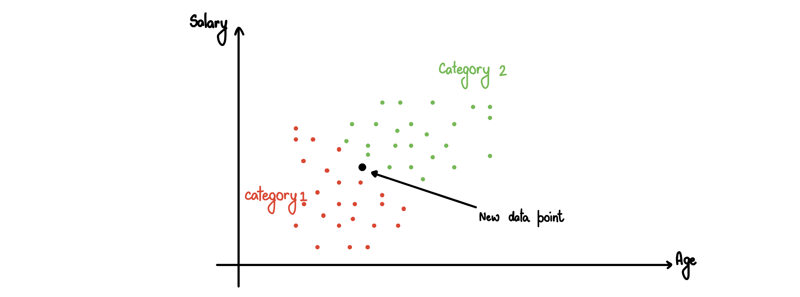

# Baye's Theorem

Let says we are given the following question: 
Men constitute 60% of the labor force. The rate’s of unemployment are 6.0% and 4.5% among males and females. A person is selected at random from the labor force. (M = Male, U = Unemployed, F = Female)

```math
P(M) = 0.6\quad P(F) = 0.4\quad P(U|M) = .06\quad P(U|F) = .045
```

1. What is the probability that the person selected is male and is unemployed?
```math
P(M\cap U) = P(M) \cdot P(U|M) = 0.6 \cdot 0.06 = 0.036
```

2. What is the probability that the person is female and is unemployed?
```math
P(F\cap U) = P(M) \cdot P(U|F) = 0.4 \cdot 0.045 = 0.018
```

Before we answer the next question, we need the Baye's Theorem, 
```math
P(B|A) = \frac{P(A \cap B) }{P(A)} \Rightarrow P(B|A) = \underbrace{\frac{  P(B) \cdot P(A|B)  }{ P(B)\cdot P(A|B) + P(B')\cdot P(A|B')  }  }_{\text{Baye's Theorem}}
```
In cases, we are given $`P(A)`$, we do not have to expand it in the longer form, instead, we can use the value for $`P(A)`$.

## A General form of Baye's Theorem

```math
P(B_i|A) =  \frac{  P(B_i) \cdot P(A|B_i)  }{ \sum_{i=1}^{m} P(B_i)\cdot P(A|B_i) }  
```

Now let's answer the question below using Baye's Theorem:

3. Suppose the person selected is unemployed, what is the probability that a male is selected?
```math
P(M|U) = frac{ P(M)\cdot P(U|M) }{ P(M)\cdot P(U|M) + P(M') \cdot P(U|M')  } = \frac{2}{3}
```

With this example of Baye's Theorem, we proceed further to talk about Naive Bayes. 

Consider the following plot,


The red points represent category 1 and the green points represents category 2. The black data point is a new point that is introduced to the plot. We need to classify this new point using Naive Bayes. Suppose we are given $`P(A),\ P(B)`$ and $`P(B|A)`$.

The following steps should be excueted when applying Naive Bayes: 
1. Use the Bayes Theorem and apply it to the new data point, and the find the porbability of our Null Hypothesis with respect to the features of the dataset. Recall the Bayes Theorem, and applying it to this example, we will have
```math
P(walks|X) = \frac{  P(X|walks) \cdot P(walks)  }{P(X)}
```

2. We will repeat step 1 but when Alternative Hypothesis. That is 
```math
P(drives|X) = \frac{  P(X|drives) \cdot P(drives)  }{P(X)}
```

3. Compare the above two porbabilities that we calculated for our new data point. If hypothesis with greater proability will be used to classify the new data point.

One thing to keep in mind is that while calculating the marginal probability (the denominator). We need to find the probability of $`X`$, that is the probability of a new data point that we add to our data set being similar in features to the points that are already in the data set. One way to calculate this would be to create a radius around the new data point, and calcualte the probability of another new data point to land in that circle.

Formula to be used to calcualte $`P(X)`$ is 
```math
P(X) = \frac{ \text{Number of Similar Observations} }{\text{Total Observations } }
```

From number of similar observations, we mean that number of observations that fall inside the circle that we drew around our new data point.

